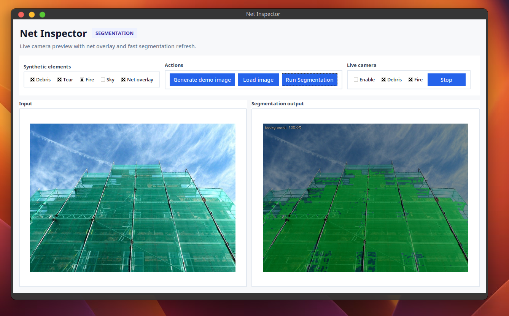
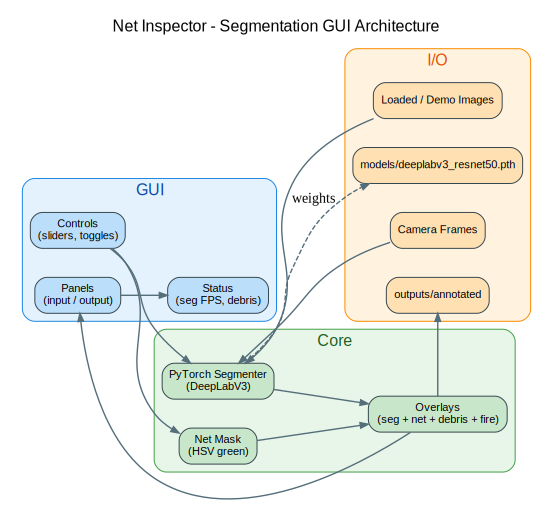
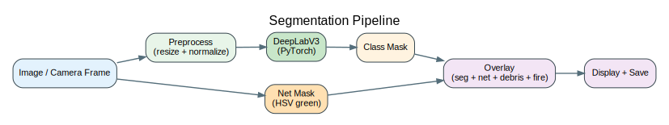
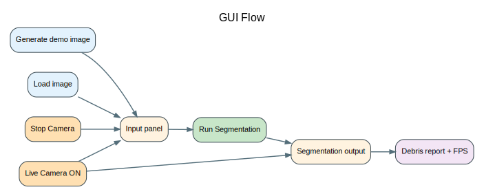

# Net Inspector (Segmentation GUI)

This repository provides a segmentation-first vision GUI for the scaffolding-net inspection robot (Challenge Cup, Tsinghua University, Zijing College). The GUI is the primary interface and supports live camera preview with PyTorch segmentation overlays.

## Focus

- Segmentation-first workflow (PyTorch)
- GUI-only operation
- Live camera + segmentation run on separate threads

## GUI Preview



## Diagrams

**Architecture**



**Segmentation pipeline**



**GUI flow**



## Quickstart (Laptop)

```bash
python -m venv .venv
source .venv/bin/activate
pip install -r requirements.txt
pip install -e .
```

Recommended install script:
```bash
scripts/install.sh
```

## Segmentation GUI (PyTorch)

Install PyTorch + weights (CPU):
```bash
pip install torch torchvision --index-url https://download.pytorch.org/whl/cpu
curl -L -o models/deeplabv3_resnet50.pth https://download.pytorch.org/models/deeplabv3_resnet50_coco-cd0a2569.pth
```

Run GUI:
```bash
python -m net_inspector.gui
```

- The status bar shows segmentation FPS.
- Enable Live Camera to see segmentation overlays update in real time.
- Use the checkboxes to toggle Net overlay, Debris, and Fire (low-confidence).
- Use the Net HSV sliders to tune green thresholds at runtime.
- Toggle Legend to show/hide segmentation labels.
- Stop the camera before loading or generating demo images.

## Live Camera Tips

- Start/Stop camera with the Live Camera checkbox.
- If the camera fails to open, close other apps using the webcam.
- Debris/Fire overlays are conservative and labeled as low confidence.

## Outputs

- Segmentation overlays: `outputs/annotated/`

## Notes

- Segmentation uses DeepLabV3 ResNet-50 weights (VOC 21 labels).
- If weights are missing, the GUI reports "Segmentation: Missing weights".
