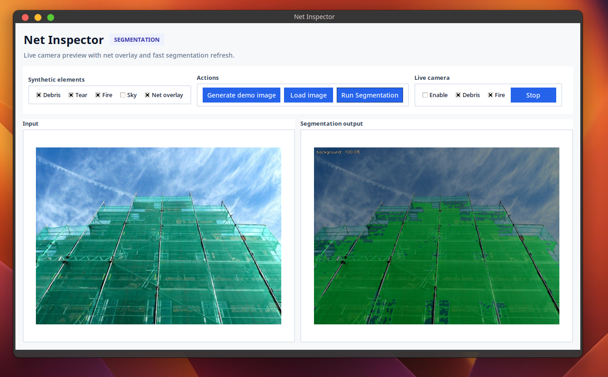
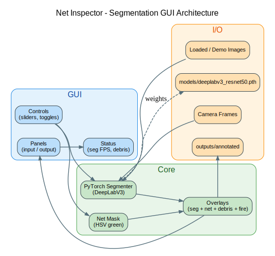
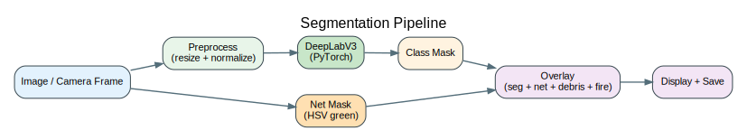
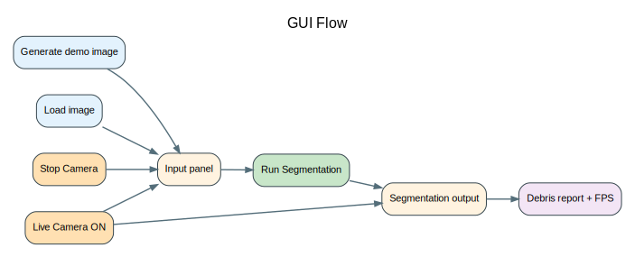

# Net Inspector (Segmentation GUI)

This repository provides a segmentation-first vision GUI for the scaffolding-net inspection robot (Challenge Cup, Tsinghua University, Zijing College). The GUI is the primary interface and supports live camera preview with PyTorch segmentation overlays.

## Focus

- Segmentation-first workflow (PyTorch)
- GUI-only operation
- Live camera + segmentation run on separate threads
- ChatGLM vision pane with markdown output

## GUI Preview



## Diagrams

**Architecture**



**Segmentation pipeline**



**GUI flow**



## Quickstart (Laptop)

```bash
python -m venv .venv
source .venv/bin/activate
pip install -r requirements.txt
pip install -e .
```

Recommended install script:
```bash
scripts/install.sh
```

## Segmentation GUI (PyTorch)

Install PyTorch + weights (CPU):
```bash
pip install torch torchvision --index-url https://download.pytorch.org/whl/cpu
curl -L -o models/deeplabv3_resnet50.pth https://download.pytorch.org/models/deeplabv3_resnet50_coco-cd0a2569.pth
```

Run GUI:
```bash
python -m net_inspector.gui
```

- The status bar shows segmentation FPS.
- Enable Live Camera to see segmentation overlays update in real time.
- Use the checkboxes to toggle Net overlay, Debris, and Fire (low-confidence).
- Use the Net HSV sliders to tune green thresholds at runtime.
- Toggle Legend to show/hide segmentation labels.
- Stop the camera before loading or generating demo images.
- Use the ChatGLM pane on the right to analyze the current frame and view markdown output.
- Use the Incident Queue controls to create, triage, and export grounded incident reports.

## ChatGLM Vision Setup

1. Add your API key to `secrets/chatglm_api_key.txt` (single line), or export `CHATGLM_API_KEY`.
2. Start GUI:

```bash
python -m net_inspector.gui
```

3. In the GUI, click **Analyze current frame** in the ChatGLM pane.
4. Use the **Model** selector in the ChatGLM toolbar to switch GLM models at runtime.

The default model endpoint is Open BigModel Chat Completions with `glm-4v-flash`.
You can edit the selectable model list in `src/net_inspector/config.py` (`GLMVisionConfig.models`).

## Grounded Incident Reports (RGB + Thermal)

The right pane now supports a lightweight reporting workflow:

1. Optionally load a thermal image with **Load thermal image**.
2. Fill metadata (`Distance`, `Position`, `Pose`, confidence slider).
3. Click **Create incident** to capture evidence-backed incident records.
4. Select an incident in the queue and set disposition: `accepted`, `needs_review`, or `rejected`.
5. Run ChatGLM while an incident is selected to attach an evidence-tagged summary.
6. Click **Export selected** to write:
   - `outputs/incidents/<incident_id>/report.json`
   - `outputs/incidents/<incident_id>/report.md`

Grounding rules:
- Observation claims are linked to explicit evidence IDs (`[EVID:...]`).
- LLM summaries are accepted only if each sentence references valid evidence IDs.
- Ungrounded summaries are rejected at attach/export time.

## Live Camera Tips

- Start/Stop camera with the Live Camera checkbox.
- If the camera fails to open, close other apps using the webcam.
- Debris/Fire overlays are conservative and labeled as low confidence.

## Outputs

- Segmentation overlays: `outputs/annotated/`

## Docs

- Clipboard paste guide: `docs/clipboard.md`

## Notes

- Segmentation uses DeepLabV3 ResNet-50 weights (VOC 21 labels).
- If weights are missing, the GUI reports "Segmentation: Missing weights".
